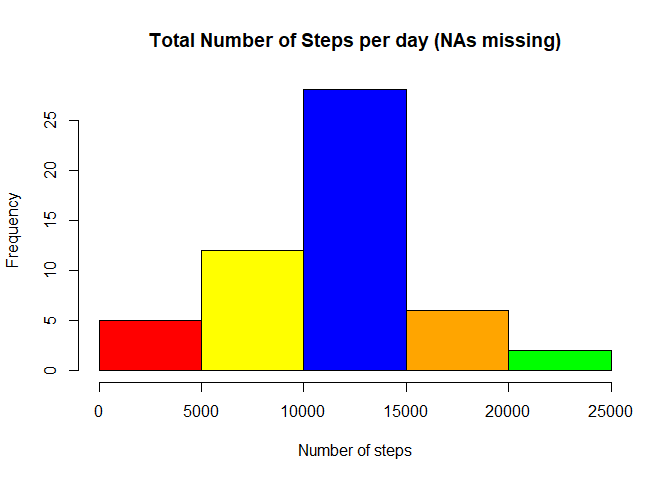
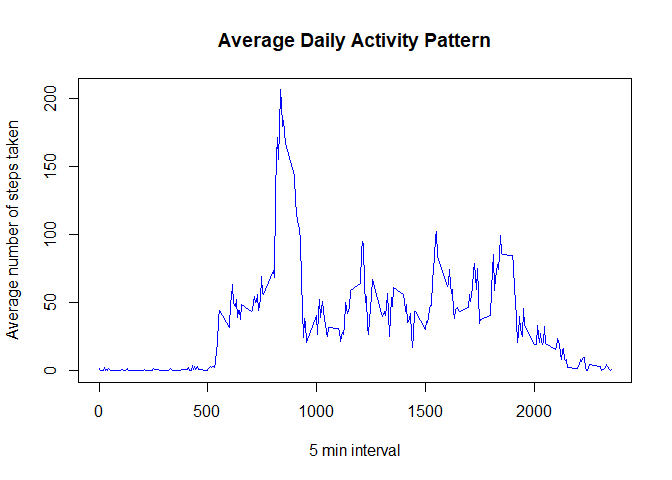
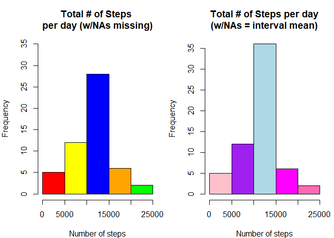
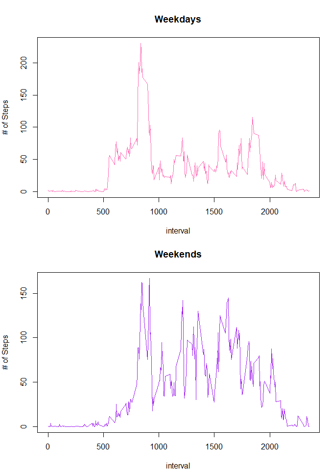

## Loading and preprocessing the data
This research will review activity monitoring data from a personal activity monitoring device. The device collected data in 5 min intervals throughout the day during the months of October and November of 2012. 
Useful tools for working with data: dplyr, timeDate, tidyverse. Use the following if not currently installed: install.packages("dplyr"), install.packages("timeDate")

```r
library(dplyr)
library(timeDate)
```

The dataset is located in activity.csv file. A preview of the data is shown.


```r
activity<-read.csv("activity.csv")
head(activity)
```

```
##   steps       date interval
## 1    NA 2012-10-01        0
## 2    NA 2012-10-01        5
## 3    NA 2012-10-01       10
## 4    NA 2012-10-01       15
## 5    NA 2012-10-01       20
## 6    NA 2012-10-01       25
```

The dataset contains missing data for several days. We will clean that data up by removing the missing values. You can see that 10-01-2012 had missing data in the orginal dataset. The clean data set no longer includes it.


```r
na_activity<-na.omit(activity)
head(na_activity)
```

```
##     steps       date interval
## 289     0 2012-10-02        0
## 290     0 2012-10-02        5
## 291     0 2012-10-02       10
## 292     0 2012-10-02       15
## 293     0 2012-10-02       20
## 294     0 2012-10-02       25
```
## What is mean total number of steps taken per day?
Suppose we wanted to look into the mean total number of steps taken per day.
We could look at the clean data and calculate the total number of steps taken per day.


```r
actsum<-na_activity %>% group_by(date) %>% summarise_at(vars(steps),list(total_steps=sum))
```
After groupping the data by day we see a preview of the total steps below along with a histogram.


```r
head(actsum)
```

```
## # A tibble: 6 x 2
##   date       total_steps
##   <chr>            <int>
## 1 2012-10-02         126
## 2 2012-10-03       11352
## 3 2012-10-04       12116
## 4 2012-10-05       13294
## 5 2012-10-06       15420
## 6 2012-10-07       11015
```

```r
hist(actsum$total_steps,main="Total Number of Steps per day (NAs missing)",xlab = "Number of steps", col=c("red","yellow","blue","orange","green"))
```

<!-- -->

The mean and median of the total steps taken per day is derived from the below:


```r
daily_avg<-na_activity%>% group_by(date)%>%summarise_at(vars(steps),list(average=mean))
daily_median<-na_activity%>% group_by(date)%>%summarise_at(vars(steps),list(middle=median))
head(daily_avg)
```

```
## # A tibble: 6 x 2
##   date       average
##   <chr>        <dbl>
## 1 2012-10-02   0.438
## 2 2012-10-03  39.4  
## 3 2012-10-04  42.1  
## 4 2012-10-05  46.2  
## 5 2012-10-06  53.5  
## 6 2012-10-07  38.2
```

```r
head(daily_median)
```

```
## # A tibble: 6 x 2
##   date       middle
##   <chr>       <dbl>
## 1 2012-10-02      0
## 2 2012-10-03      0
## 3 2012-10-04      0
## 4 2012-10-05      0
## 5 2012-10-06      0
## 6 2012-10-07      0
```

We could also look into the average daily activity pattern as seen by the plot.


```r
interval_avg<-na_activity%>% group_by(interval)%>% summarise_at(vars(steps),list(average=mean))
plot(interval_avg$interval,interval_avg$average,type="l",xlab="5 min interval",ylab="Average number of steps taken",col="blue",main = "Average Daily Activity Pattern")
```

<!-- -->

The plot clearly shows an interval period that contains the maximum number of steps. The below can be used to extract the max steps.

```r
interval_avg[which.max(interval_avg$average),]
```

```
## # A tibble: 1 x 2
##   interval average
##      <int>   <dbl>
## 1      835    206.
```

```
## [1] "The 5 min interval of 835 contains the maximum number of steps of 206.169811320755 ."
```

What about those missing values that were omitted earlier? 


```r
s<-sum(is.na(activity$steps))
```

```
## [1] "The total number of missing values is 2304 ."
```


## What is the average daily activity pattern?
Let's revisit the original dataset and fill in the missing data with the average steps per interval. The interval averages are appended to the original dataset. Then if the steps are missing or have NA values, they are replaced with the averages that were appended.


## Imputing missing values

The below shows the first few lines of the dataset where NAs were present and then again where it has been replaced with corresponding interval average.

```r
head(activity)
```

```
##   steps       date interval
## 1    NA 2012-10-01        0
## 2    NA 2012-10-01        5
## 3    NA 2012-10-01       10
## 4    NA 2012-10-01       15
## 5    NA 2012-10-01       20
## 6    NA 2012-10-01       25
```

```r
head(activity2)
```

```
##       steps       date interval interval_avg$average
## 1 1.7169811 2012-10-01        0            1.7169811
## 2 0.3396226 2012-10-01        5            0.3396226
## 3 0.1320755 2012-10-01       10            0.1320755
## 4 0.1509434 2012-10-01       15            0.1509434
## 5 0.0754717 2012-10-01       20            0.0754717
## 6 2.0943396 2012-10-01       25            2.0943396
```
Now we can look at a plot of the dataset with the missing data filled in to see the total number of steps taken per day and compare that to the plot without the missing data.


```r
act2sum<-activity2%>% group_by(date)%>% summarise_at(vars(steps),list(total_steps=sum))
par(mfrow=c(1,2),mar=c(4,4,4,1))
hist(actsum$total_steps,main="Total # of Steps \nper day (w/NAs missing)",xlab = "Number of steps", ylim=c(0,35),col=c("red","yellow","blue","orange","green"))
hist(act2sum$total_steps,main="Total # of Steps per day\n(w/NAs = interval mean)",xlab = "Number of steps", col=c("pink","purple","lightblue","magenta","hotpink"))
```

<!-- -->

The mean and median of the replaced missing values dataset can be determined.


```r
daily_avg2<-act2sum %>% group_by(date)%>%summarise_at(vars(total_steps),list(average=mean))
daily_median2<-act2sum%>%group_by(date)%>%summarise_at(vars(total_steps),list(middle=median))
head(daily_avg2)
```

```
## # A tibble: 6 x 2
##   date       average
##   <chr>        <dbl>
## 1 2012-10-01  10766.
## 2 2012-10-02    126 
## 3 2012-10-03  11352 
## 4 2012-10-04  12116 
## 5 2012-10-05  13294 
## 6 2012-10-06  15420
```

```r
head(daily_median2)
```

```
## # A tibble: 6 x 2
##   date       middle
##   <chr>       <dbl>
## 1 2012-10-01 10766.
## 2 2012-10-02   126 
## 3 2012-10-03 11352 
## 4 2012-10-04 12116 
## 5 2012-10-05 13294 
## 6 2012-10-06 15420
```

Looking at the two plots, the estimates differ primarily due to the 8 dates where steps were missing. The missing data was replaced with the average # of steps per interval and therefore the total daily steps for those dates are exactly the same. This affects the bin of the histogram.

## Are there differences in activity patterns between weekdays and weekends?

What if we wanted to explore whether the activity patterns differ depending on whether it was a weekday or weekend?

We can take another look at the updated data set with filled in missing values and make a new column indicating whether the day fell on a weekday or weekend.


```r
act_week<-mutate(activity2,week=if_else(isWeekday(activity2$date),"Weekday","Weekend"))
```
A preview is below:

```r
head(act_week)
```

```
##       steps       date interval interval_avg$average    week
## 1 1.7169811 2012-10-01        0            1.7169811 Weekday
## 2 0.3396226 2012-10-01        5            0.3396226 Weekday
## 3 0.1320755 2012-10-01       10            0.1320755 Weekday
## 4 0.1509434 2012-10-01       15            0.1509434 Weekday
## 5 0.0754717 2012-10-01       20            0.0754717 Weekday
## 6 2.0943396 2012-10-01       25            2.0943396 Weekday
```
Lets plot the dataset to see if there is a difference in the activity on a weekday versus weekend.

```r
act_wkday<-filter(act_week,week=="Weekday")
act_wkend<-filter(act_week,week=="Weekend")
wkdayplot<-act_wkday%>%group_by(interval)%>%summarise_at(vars(steps),list(average=mean))
wkendplot<-act_wkend%>%group_by(interval)%>%summarise_at(vars(steps),list(average=mean))
par(mfrow=c(2,1),mar=c(4,4,4,1))
with(wkdayplot,plot(interval, average,ylab="# of Steps",main="Weekdays",col="hotpink",type="l"))
with(wkendplot,plot(interval, average,ylab="# of Steps",main="Weekends",col="purple",type="l"))
```

<!-- -->


